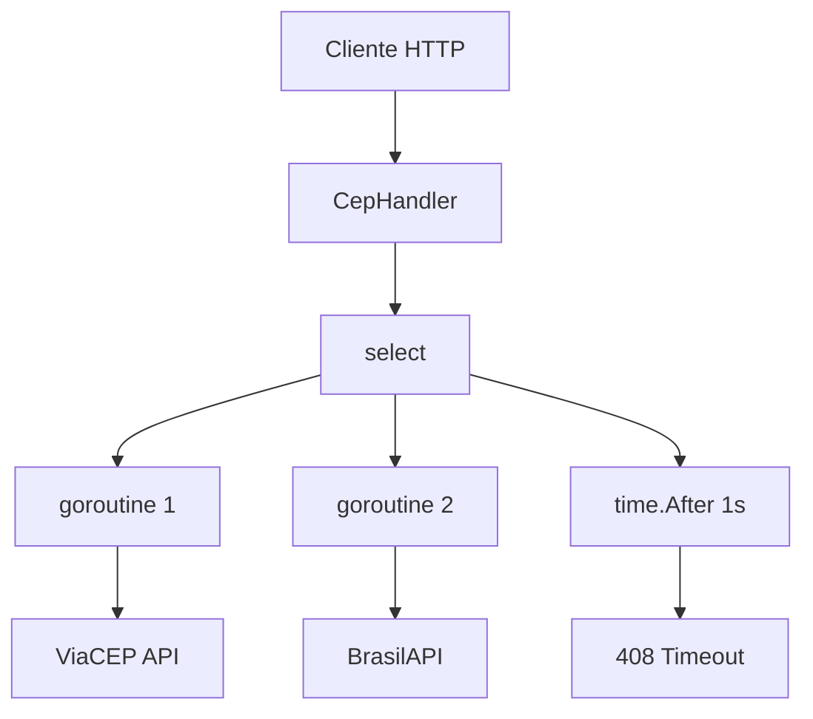

# 🏠 Consulta CEP — Desafio 02

API em Go que consulta CEPs simultaneamente em duas fontes externas (**ViaCEP** e **BrasilAPI**) usando goroutines e `select`, retornando a resposta mais rápida. Se ambas demorarem mais de **1 segundo**, retorna timeout.

## ⚡ Tecnologias

- **Go 1.25+**
- [Chi v5](https://github.com/go-chi/chi) — roteamento HTTP
- Goroutines + Channels — concorrência
- `select` — corrida entre respostas

## 📁 Estrutura do Projeto

```
desafio-02/
├── cmd/
│   └── server/
│       └── main.go              # Entrypoint do servidor
├── internal/
│   ├── dto/
│   │   ├── cep.go               # DTO unificado (Cep)
│   │   ├── via_cep.go           # DTO ViaCEP + ToCep()
│   │   └── brasil_api.go        # DTO BrasilAPI + ToCep()
│   ├── handler/
│   │   └── consulta_cep.go      # Handlers HTTP (corrida entre APIs)
│   └── infra/
│       └── rest/
│           ├── cep_interface.go  # Interface CepInterface
│           ├── via_cep.go        # Cliente ViaCEP
│           └── brasil_api.go     # Cliente BrasilAPI
├── tests/
│   └── api.http                  # Requisições de teste (REST Client)
├── go.mod
├── go.sum
└── README.md
```

## 🚀 Como Executar

```bash
go run ./cmd/server/main.go
```

O servidor inicia na porta **8000**.

## 📡 Endpoints

| Método | Rota | Descrição |
|--------|------|-----------|
| `GET` | `/cep/{cep}` | Corrida real entre ViaCEP e BrasilAPI — retorna o mais rápido |
| `GET` | `/brasilapi/{cep}` | Simula ViaCEP lento (2s delay) — BrasilAPI vence |
| `GET` | `/viacep/{cep}` | Simula BrasilAPI lenta (2s delay) — ViaCEP vence |
| `GET` | `/timeout/{cep}` | Simula ambos lentos (2s delay cada) — retorna timeout |

### Exemplo de Requisição

```bash
curl http://localhost:8000/cep/01001000
```

### Resposta de Sucesso (200)

```json
{
  "Cep": "01001-000",
  "Logradouro": "Praça da Sé",
  "Bairro": "Sé",
  "Cidade": "São Paulo",
  "Estado": "SP",
  "Source": "brasil_api"
}
```

O campo `Source` indica qual API respondeu primeiro (`via_cep` ou `brasil_api`).

### Resposta de Timeout (408)

```json
{
  "error": "request timeout"
}
```

### Resposta de CEP Inválido (400)

```json
{
  "error": "CEP inválido"
}
```

## 🏗️ Arquitetura



- Ambas as APIs são chamadas **simultaneamente** em goroutines separadas
- O `select` aguarda quem responder **primeiro** (ou timeout de 1s)
- A interface `CepInterface` permite trocar ou adicionar novas fontes de CEP facilmente

## 🧪 Testando

Use o arquivo `tests/api.http` com a extensão [REST Client](https://marketplace.visualstudio.com/items?itemName=humao.rest-client) do VS Code, ou use `curl`:

```bash
# Corrida real
curl http://localhost:8000/cep/23058230

# Forçar BrasilAPI como vencedora
curl http://localhost:8000/brasilapi/23058230

# Forçar ViaCEP como vencedora
curl http://localhost:8000/viacep/23058230

# Forçar timeout
curl http://localhost:8000/timeout/23058230
```

## 📝 Formato do CEP

Aceita os formatos:
- `XXXXXXXX` (8 dígitos)
- `XXXXX-XXX` (com hífen)
